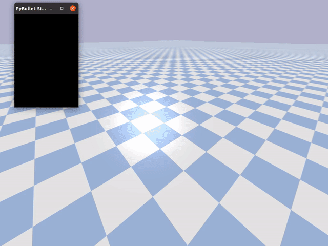
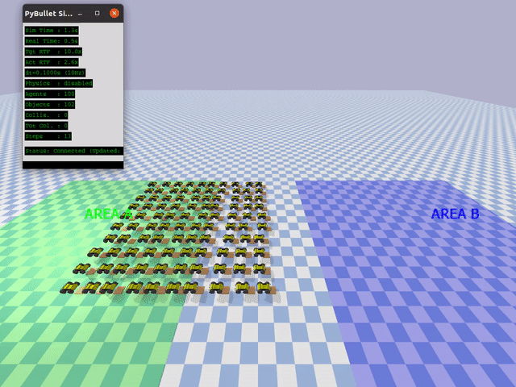
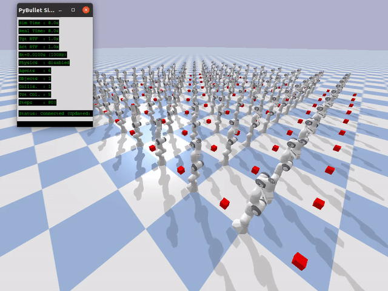

# PyBulletFleet

[](https://pybulletfleet.readthedocs.io/en/latest/)

<table align="center">
<tr>
<td align="center"><b>Mixed Fleet Grid</b><br><sub>100robots_grid_demo.py</sub><br>
</td>
<td align="center"><b>Cube Patrol</b><br><sub>100robots_cube_patrol_demo.py</sub><br>
</td>
</tr>
<tr>
<td align="center"><b>Mobile Pick & Drop</b><br><sub>pick_drop_mobile_100robots_demo.py</sub><br>
</td>
<td align="center"><b>Arm Pick & Drop</b><br><sub>pick_drop_arm_100robots_demo.py</sub><br>
</td>
</tr>
</table>

A **kinematics-first** simulation framework for large-scale multi-robot fleets, built on PyBullet and designed for **fast N× real-time** evaluation.

## What is PyBulletFleet?

Different simulation goals call for different tools.
Physics-focused simulators (Gazebo, Isaac Sim, MuJoCo, etc.) excel at accurate contact dynamics, sensor modelling, and single-robot control — but stepping a full physics engine for every robot becomes the bottleneck when you need to evaluate **fleet-level** systems at scale.

PyBulletFleet sits in a different part of the design space: it is a **kinematics-first, fleet-scale** simulation engine whose primary goal is to enable fast development and testing of the software that *orchestrates* robot fleets rather than the software that *controls* individual robots.

### Design Priorities

- **Speed over fidelity** — Fleet algorithms (task allocation, traffic control, path planning) must be tested with hundreds to thousands of robots running *much faster* than real time. Kinematics-based stepping — teleporting each robot to its next pose without calling `stepSimulation()` — removes the physics bottleneck and enables N× real-time execution.
- **System integration over low-level control** — The primary consumers are high-level systems: WMS (Warehouse Management Systems), task orchestrators, fleet managers, and monitoring dashboards. These systems issue goals, observe progress via state snapshots, and react to events — they do not need joint-level torque feedback.
- **Scale over detail** — Validating behaviour at 100+ robot scale matters more than modelling individual link dynamics or sensor noise.
- **Interoperability** — The simulation is designed around a callback-driven step loop and snapshot-friendly state model, so that it can be plugged into larger orchestration frameworks, replay pipelines, or external control systems (e.g., gRPC / ROS 2) as those interfaces are built out.
- **Physics as an option** — When physical interaction *is* needed (grasping, conveyor dynamics, contact verification), full PyBullet physics can be switched on per-scenario without changing the rest of the stack.

### Target Use Cases

| Use Case | Description |
|----------|-------------|
| Fleet algorithm evaluation | Test path planning, task allocation, and traffic control for large robot fleets at N× real-time speed |
| Warehouse simulation | Simulate pick-and-place, patrol, and transport operations with mobile robots and arms |
| Scalability benchmarking | Measure how fleet software scales from tens to thousands of agents |
| Rapid prototyping | Quickly iterate on multi-robot behaviors with minimal boilerplate |

## Quick Start

### Install from PyPI

```bash
pip install pybullet-fleet
```

### Or install from source (for development)

```bash
git clone https://github.com/yuokamoto/PyBulletFleet.git
cd PyBulletFleet
pip install -e ".[dev]"
```

### Run a demo

```bash
# If installed from source:
python examples/scale/100robots_grid_demo.py
```

Most demo scripts accept a `--robot` argument to swap the robot model.
Pass a model name (resolved via `resolve_urdf()`) or a direct URDF path:

```bash
python examples/scale/100robots_grid_demo.py --robot racecar
python examples/arm/pick_drop_arm_demo.py --robot kuka_iiwa
python examples/models/resolve_urdf_demo.py --list
```

| Category | Scripts | `--robot` default | Alternatives |
|----------|---------|-------------------|-------------|
| Arm demos | `examples/arm/pick_drop_arm_*.py`, `rail_arm_demo.py` | `panda` | `kuka_iiwa`, `arm_robot` |
| Mobile demos | `examples/mobile/path_following_demo.py` | `husky` | `racecar`, `mobile_robot` |
| Scale demos (mobile) | `100robots_cube_patrol_demo.py`, `pick_drop_mobile_100robots_demo.py` | `husky` | `racecar`, `mobile_robot` |
| Scale demos (arm) | `pick_drop_arm_100robots_demo.py` | `panda` | `kuka_iiwa`, `arm_robot` |
| Model demos | `resolve_urdf_demo.py`, `robot_descriptions_demo.py` | `panda` / `tiago` | any registered model |

`100robots_grid_demo.py` has two arguments: `--robot` for the mobile robot (default: `husky`) and `--arm-robot` for the arm (default: `panda`).

See [Tutorial 6 — Robot Models](https://pybulletfleet.readthedocs.io/en/latest/examples/robot-models.html) for the full model resolution system.

## Performance

<!-- sync with docs/benchmarking/results.md -->
> Results from a single test environment (Intel i7-1185G7, 32 GB RAM, Ubuntu 20.04). Your numbers will vary depending on hardware.

| Agents | Real-Time Factor | Step Time |
|--------|-----------------|-----------|
| 100    | 46× | 2.2 ms  |
| 500    | 7.6×| 13.2 ms |
| 1000   | 3.3×| 30.0 ms |
| 2000   | 1.1×| 94.8 ms |

Kinematics mode (physics OFF), headless. See [Benchmark Results](benchmark/README.md#benchmark-results) for full data, component breakdown, and methodology.

## Robot Models

PyBulletFleet includes a model resolution system that loads robots **by name** from multiple sources:

```python
from pybullet_fleet import MultiRobotSimulationCore, Agent, Pose, resolve_urdf

sim = MultiRobotSimulationCore()

# Resolve by name — searches local robots/, pybullet_data, robot_descriptions
urdf = resolve_urdf("panda")

# Agent.from_urdf() calls resolve_urdf() internally
agent = Agent.from_urdf(urdf_path="panda", pose=Pose.from_xyz(0, 0, 0), sim_core=sim)
```

| Tier | Source | Example models |
|------|--------|---------------|
| 0 — local | `robots/` directory | arm_robot, mobile_robot, mobile_manipulator |
| 1 — pybullet_data | PyBullet bundled | panda, kuka_iiwa, r2d2 |
| 2 — ROS | ROS install paths | (future) |
| 3 — robot_descriptions | pip package | tiago, pr2 (`pip install robot_descriptions`) |

Run `python examples/models/resolve_urdf_demo.py --list` to see all registered models and their availability.

## Documentation

📖 **Full documentation:** [Read the Docs](https://pybulletfleet.readthedocs.io)

For local builds:
```bash
cd docs && sphinx-build -b html . _build/html
```

## Development Setup

A root `Makefile` provides all common dev commands. Run `make help` to list targets.

```bash
make verify        # Lint + test (CI subset, excludes docs/security)
make test          # Tests with coverage (75% threshold)
make test-fast     # Quick test (stop on first failure)
make lint          # All pre-commit hooks (black, pyright, flake8)
make format        # Auto-format with black
make typecheck     # Pyright type check
make bench-smoke   # Quick benchmark (~10s)
make docs          # Sphinx docs (warnings = errors)
make clean         # Remove caches and build artifacts
```

### Pre-commit hooks

Install pre-commit hooks for automatic formatting and linting on commit:

```bash
pip install pre-commit
pre-commit install
```
