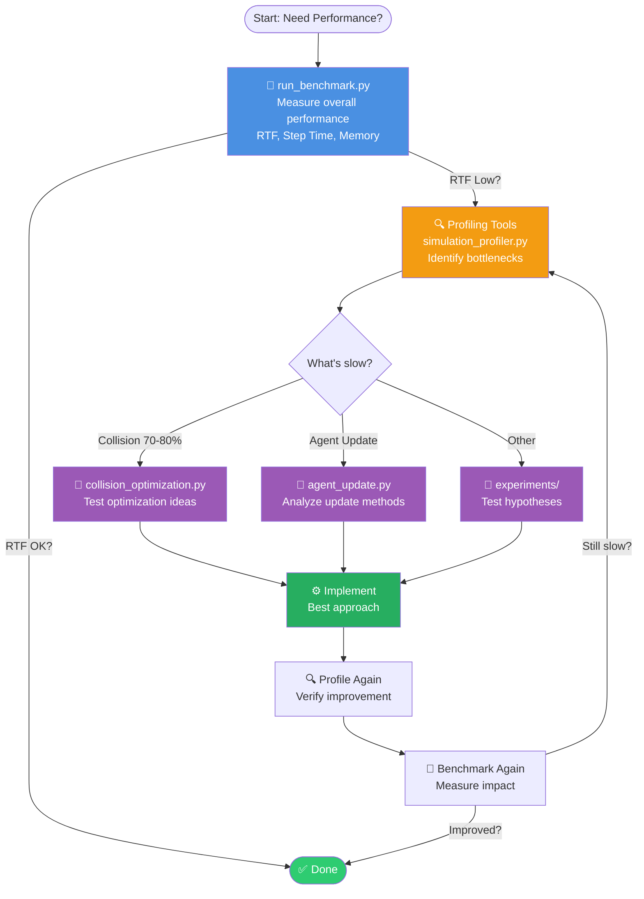

# PyBullet Fleet - Performance Benchmark Suite

This directory contains the benchmark **scripts and configs**. For full documentation (results, profiling guide, optimization guide), see [docs/benchmarking/](../docs/benchmarking/index.md).

## Performance Optimization Workflow



**Workflow Summary:**
1. **Benchmark** → Measure overall performance (RTF, step time)
2. **Profile** → Identify bottlenecks (which component is slow?)
3. **Experiment** → Test optimization ideas (A/B testing)
4. **Implement** → Apply best approach
5. **Verify** → Profile & benchmark again

**Tool Categories:**
- 🎯 **Benchmarking:** `run_benchmark.py`, `performance_benchmark.py`
- 🔍 **Profiling:** `profiling/simulation_profiler.py`, `collision_check.py`, `agent_update.py`
- 🧪 **Experiments:** `experiments/collision_optimization.py`, `performance_analysis.py`

---

## Directory Structure

```
benchmark/
├── README.md                          # This file (includes configuration guide)
├── PERFORMANCE_REPORT.md              # Detailed performance analysis report
├── COLLISION_BENCHMARK_RESULTS.md     # Collision detection performance results
│
# Benchmark Configuration Files
├── configs/                           # Benchmark-specific configurations
│   ├── README.md                      # Config files documentation
│   ├── general.yaml                   # General benchmark config (default)
│   ├── collision_physics_off.yaml     # Collision: Physics OFF (recommended)
│   ├── collision_physics_on.yaml      # Collision: Physics ON
│   └── collision_hybrid.yaml          # Collision: Hybrid mode
│
# Benchmark Results
├── results/                           # Benchmark results (JSON files)
│   ├── benchmark_results_*.json       # Individual test results
│   └── benchmark_sweep_*.json         # Sweep test results
│
# Main Benchmarking Tools (Worker + Orchestrator Pattern)
├── performance_benchmark.py           # Worker: Single benchmark execution
├── run_benchmark.py                   # Orchestrator: Multi-run, sweep, comparison
│
# Profiling Tools (detailed CPU/memory analysis)
├── profiling/
│   ├── README.md                      # Profiling tools documentation
│   ├── simulation_profiler.py         # Step-by-step profiling
│   ├── collision_check.py             # Collision check profiling
│   ├── collision_mode_comparison.py   # Physics ON/OFF profiling
│   ├── agent_update.py                # Agent update profiling (5 analysis methods)
│   ├── agent_manager_set_goal.py      # AgentManager goal setting profiling
│   └── parse_profile.py               # Log parser for profiling data
│
# Experiments (optimization validation and hypothesis testing)
├── experiments/
│   ├── README.md                      # Experiments documentation
│   ├── collision_detection_methods_benchmark.py  # PyBullet API comparison
│   ├── collision_methods_config_based.py         # Config-based comparison (recommended)
│   ├── collision_method_comparison.py            # Algorithm comparison
│   ├── collision_optimization.py                 # Optimization tests
│   ├── performance_analysis.py                   # Component performance comparison
│   ├── list_filtering_benchmark.py               # List filtering micro-benchmark
│   └── getaabb_performance.py                    # AABB retrieval performance tests
│
# Archive (deprecated/development tools)
└── archive/
    ├── update_benchmark.py            # Legacy config update script
    └── CONFIG_GUIDE.md                # Merged into README.md
```

---

## Architecture: Worker + Orchestrator Pattern

The benchmark suite uses a clean separation of concerns:

### **Worker** (`performance_benchmark.py`)
- **Purpose**: Execute a single benchmark test
- **Responsibilities**:
  - Load configuration from YAML
  - Create and run simulation
  - Measure performance metrics (RTF, step time, memory)
  - Output JSON result to stdout
- **Interface**: Simple CLI with `--agents`, `--duration`, `--scenario`
- **Isolation**: Each test runs in a separate process for clean memory state

### **Orchestrator** (`run_benchmark.py`)
- **Purpose**: Manage multiple benchmark runs and analysis
- **Responsibilities**:
  - Spawn worker processes
  - Parse and aggregate JSON results
  - Compute statistics (median, mean, stdev)
  - Generate comparison tables and summaries
- **Modes**:
  1. **Single Test**: Run one benchmark with statistics
  2. **Sweep**: Test multiple agent counts
  3. **Compare**: Compare different scenarios

This design avoids self-recursion complexity and makes the codebase more maintainable.

---

## Quick Start

### 1. Basic Performance Benchmark

Run a single benchmark with 1000 agents for 10 seconds:

```bash
python benchmark/run_benchmark.py --agents 1000 --duration 10
```

**Output:**
```
======================================================================
PyBullet Fleet - Performance Benchmark Runner
======================================================================

======================================================================
Benchmark: 1000 agents, 10.0s, scenario=default
======================================================================
  Run 1/3... done
  Run 2/3... done
  Run 3/3... done

======================================================================
Results
======================================================================

Configuration:
  Agents: 1000
  Duration: 10.0s
  Scenario: default
  Repetitions: 3

Performance:
  Real-Time Factor: 5.34x (±0.12)
  Step Time: 18.72ms (±0.42)
  Spawn Time: 0.025s (±0.001)
  Memory: -26.50MB (±1.20)

Assessment:
  RTF: ✅ GOOD (5.34x)
======================================================================
```

### 2. Multi-Agent Sweep Benchmark

Run benchmarks across multiple agent counts:

```bash
python benchmark/run_benchmark.py --sweep 100 500 1000 2000 5000
```

**Output:**
```
======================================================================
Sweep Results (5.0s simulations)
======================================================================
Agents    RTF         Step Time    Spawn Time    Memory
--------  ----------  -----------  ------------  ----------
100       57.01x      1.75ms       0.022s        -25.12MB
500       10.78x      9.27ms       0.024s        -25.87MB
1000      5.34x       18.72ms      0.025s        -26.50MB
2000      2.67x       37.45ms      0.028s        -27.83MB
5000      1.07x       93.62ms      0.035s        -31.24MB
======================================================================
```

### 3. Scenario Comparison

Compare different collision detection scenarios:

```bash
python benchmark/run_benchmark.py --compare no_collision collision_2d_10hz collision_3d_full --agents 1000
```

**Output:**
```
======================================================================
Scenario Comparison (1000 agents, 10.0s)
======================================================================
Scenario             RTF         Step Time    Memory
-------------------  ----------  -----------  ----------
no_collision         23.38x      4.28ms       -25.50MB
collision_2d_10hz    7.58x       13.20ms      -26.12MB
collision_3d_full    2.15x       46.51ms      -28.75MB
======================================================================
```

### 4. Custom Scenario

Run with a specific scenario from `benchmark_config.yaml`:

```bash
python benchmark/run_benchmark.py --agents 1000 --scenario no_collision
```

---

## Benchmark Tools

### `run_benchmark.py` (Orchestrator)

**Purpose:** Manage benchmark execution, statistics, and analysis

**Features:**
- Three modes: single test, sweep, compare
- Statistical analysis (median, mean, stdev)
- Formatted output with assessment
- JSON export for historical tracking
- Process isolation for clean measurements

**Usage:**

```bash
# Single test with default scenario
python benchmark/run_benchmark.py --agents 1000

# Single test with custom scenario
python benchmark/run_benchmark.py --agents 1000 --scenario no_collision --duration 10

# Multi-run for statistics
python benchmark/run_benchmark.py --agents 1000 --repetitions 5

# Sweep across agent counts
python benchmark/run_benchmark.py --sweep 100 500 1000 2000

# Sweep with custom scenario and duration
python benchmark/run_benchmark.py --sweep 100 1000 5000 --scenario collision_2d_10hz --duration 30

# Compare scenarios
python benchmark/run_benchmark.py --compare no_collision collision_2d_10hz collision_3d_full --agents 1000

# With GUI (slower, for visualization)
python benchmark/run_benchmark.py --agents 100 --gui
```

**Output Files:**
- `benchmark_results_<agents>agents_<duration>s_<scenario>.json` - Single test
- `benchmark_sweep_<duration>s.json` - Sweep results
- `benchmark_compare_<agents>agents_<duration>s.json` - Scenario comparison

---

### `performance_benchmark.py` (Worker)

**Purpose:** Execute a single benchmark test (usually called by `run_benchmark.py`)

**Features:**
- Load configuration from YAML
- Measure RTF, step time, memory usage
- Output JSON to stdout
- Simple, focused interface

**Direct Usage** (for scripting/automation):
```bash
# Basic test
python benchmark/performance_benchmark.py --agents 1000 --duration 10

# With scenario
python benchmark/performance_benchmark.py --agents 1000 --duration 10 --scenario no_collision

# With custom config
python benchmark/performance_benchmark.py --agents 1000 --config custom_config.yaml

# With GUI
python benchmark/performance_benchmark.py --agents 100 --gui
```

**Output Format** (JSON to stdout):
```json
{
  "num_agents": 1000,
  "duration_s": 10.0,
  "scenario": "no_collision",
  "real_time_factor": 5.34,
  "avg_step_time_ms": 18.72,
  "spawn_time_s": 0.025,
  "memory_delta_mb": -26.50,
  "timestamp": "2025-01-31T10:30:45"
}
```

---

## Configuration

### Configuration File: `benchmark_config.yaml`

The benchmark suite uses a centralized YAML configuration file to manage simulation parameters and predefined scenarios.

#### Basic Usage

```bash
# Use default configuration
python benchmark/run_benchmark.py --agents 1000

# Use specific scenario
python benchmark/run_benchmark.py --agents 1000 --scenario no_collision

# Use custom config file
python benchmark/run_benchmark.py --agents 1000 --config custom_config.yaml
```

#### Configuration Structure

```yaml
simulation:
  timestep: 0.1                        # Simulation timestep (seconds)
  speed: 0.0                           # 0 = maximum speed (no sleep)
  physics: false                       # Enable physics (usually false for benchmarks)
  collision_check_frequency: null      # Hz, null=every step, 0=disabled
  collision_check_2d: false            # 2D mode (9 neighbors vs 27)
  ignore_static_collision: true     # Ignore structure collisions

scenarios:
  no_collision:
    simulation:
      collision_check_frequency: 0     # Disabled

  collision_2d_10hz:
    simulation:
      collision_check_frequency: 10    # 10 Hz
      collision_check_2d: true         # 2D mode

  collision_3d_full:
    simulation:
      collision_check_frequency: null  # Every step
      collision_check_2d: false        # 3D mode (27 neighbors)
```

#### Collision Detection Parameters

**Frequency Control** (`collision_check_frequency`):
- `null`: Every step (most accurate, slowest)
- `10.0`: 10 Hz (10 times per second)
- `1.0`: 1 Hz (once per second)
- `0`: Disabled (fastest)

**Dimension Control** (`collision_check_2d`):
- `true`: 2D collision (9 neighbors, XY plane only)
  - ~67% faster than 3D
  - For ground robots (AGVs), fixed Z position
- `false`: 3D collision (27 neighbors, all directions)
  - Accurate but slower
  - For drones, lifts, 3D movement

#### Predefined Scenarios

**1. `no_collision` - Maximum Performance**
```yaml
no_collision:
  simulation:
    collision_check_frequency: 0  # Completely disabled
```
- **Use case**: Baseline performance measurement

**2. `collision_2d_10hz` - Balanced (Recommended)**
```yaml
collision_2d_10hz:
  simulation:
    collision_check_frequency: 10.0  # 10 Hz
    collision_check_2d: true         # 2D optimization
```
- **Use case**: Ground robots (AGVs), production setting

**3. `collision_3d_full` - Maximum Accuracy**
```yaml
collision_3d_full:
  simulation:
    collision_check_frequency: null  # Every step
    collision_check_2d: false        # 3D (27 neighbors)
```
- **Use case**: Drones, 3D movement, safety-critical scenarios

#### Creating Custom Scenarios

Add your own scenarios to `benchmark_config.yaml`. Below are examples:

```yaml
scenarios:
  # Low-frequency collision
  low_freq_collision:
    simulation:
      collision_check_frequency: 1.0   # 1 Hz
      collision_check_2d: true

  # High-frequency 2D
  high_freq_2d:
    simulation:
      collision_check_frequency: 30.0  # 30 Hz
      collision_check_2d: true
```

#### Performance Tuning Tips

**For Maximum Performance**:
```yaml
simulation:
  collision_check_frequency: 0     # No collision
  physics: false                   # No physics
  enable_profiling: false          # No profiling overhead
```

**For Balanced Performance** (Recommended):
```yaml
simulation:
  collision_check_frequency: 10.0  # 10 Hz
  collision_check_2d: true         # 2D optimization
  physics: false
```

**For Maximum Accuracy**:
```yaml
simulation:
  collision_check_frequency: null  # Every step
  collision_check_2d: false        # 3D accurate
  physics: true                    # Full physics
```

**Usage:**
- Default config: `benchmark/benchmark_config.yaml`
- Custom config: `--config path/to/config.yaml`
- Select scenario: `--scenario no_collision`

---

## Profiling Tools

**For detailed profiling documentation, see [`profiling/README.md`](profiling/README.md)**

Located in `benchmark/profiling/` - these tools provide detailed CPU time and memory analysis of specific simulation components.

### Quick Overview

| Tool | Purpose | Typical Use Case |
|------|---------|------------------|
| `simulation_profiler.py` | Overall bottleneck identification | Where is the slowdown? |
| `collision_check.py` | Collision detection details | Why is collision slow? |
| `agent_update.py` | Agent update details (5 methods) | Why is Agent.update() slow? |
| `agent_manager_set_goal.py` | Goal setting profiling | Why is set_goal_pose() slow? |
| `parse_profile.py` | Parse profiling logs | Analyze [PROFILE] output |

**👉 For detailed documentation, usage examples, and profiling methodology, see [`profiling/README.md`](profiling/README.md)**

---

## Experiments

**For detailed experiment documentation, see [`experiments/README.md`](experiments/README.md)**

Located in `benchmark/experiments/` - these scripts validate optimization hypotheses and compare different implementation approaches.

### Quick Overview

| Tool | Purpose | Typical Use Case |
|------|---------|------------------|
| `performance_analysis.py` | Compare wrapper layers | Is SimObject overhead significant? |
| `collision_optimization.py` | Test collision algorithms | Spatial hash vs brute force? |
| `list_filtering_benchmark.py` | Python list filtering | List comp vs for loop? |
| `getaabb_performance.py` | Test AABB retrieval | Is getAABB() a bottleneck? |

**👉 For detailed documentation, usage examples, and experiment methodology, see [`experiments/README.md`](experiments/README.md)**

---

## Performance Reports

See [`PERFORMANCE_REPORT.md`](PERFORMANCE_REPORT.md) for detailed performance analysis and optimization results.

---

## Performance Optimization

**For comprehensive optimization guidance, see [`PERFORMANCE_OPTIMIZATION_GUIDE.md`](PERFORMANCE_OPTIMIZATION_GUIDE.md)**

### Quick Tips

**Maximum Performance (Offline):**
```python
params = SimulationParams(speed=0, gui=False, collision_check_2d=True, enable_profiling=False)
```

**Real-Time Visualization:**
```python
params = SimulationParams(speed=1.0, gui=True, collision_check_frequency=10.0)
```

**See the optimization guide for:**
- Detailed parameter explanations
- Use case recommendations
- Troubleshooting tips
- Configuration examples

---

## Performance Metrics

### Real-Time Factor (RTF)

**Definition:** How many seconds of simulation time can be executed in 1 second of wall-clock time

**Assessment:**
- ✅ Excellent: RTF > 2.0
- ⚠️ Good: RTF 1.0 - 2.0
- ❌ Poor: RTF < 1.0

**See `PERFORMANCE_REPORT.md` for detailed analysis.**

---

## See Also

- [`PERFORMANCE_OPTIMIZATION_GUIDE.md`](PERFORMANCE_OPTIMIZATION_GUIDE.md) - Comprehensive optimization guide
- [`PERFORMANCE_REPORT.md`](PERFORMANCE_REPORT.md) - Detailed performance analysis
- [`profiling/README.md`](profiling/README.md) - Profiling tools documentation
- [`experiments/README.md`](experiments/README.md) - Optimization experiments
- `../docs/` - General documentation
- `../tests/` - Unit and integration tests
- `../example/` - Usage examples with performance notes

---

**Last Updated:** 2026-01-04
**PyBullet Fleet Version:** Latest (post-optimization)
