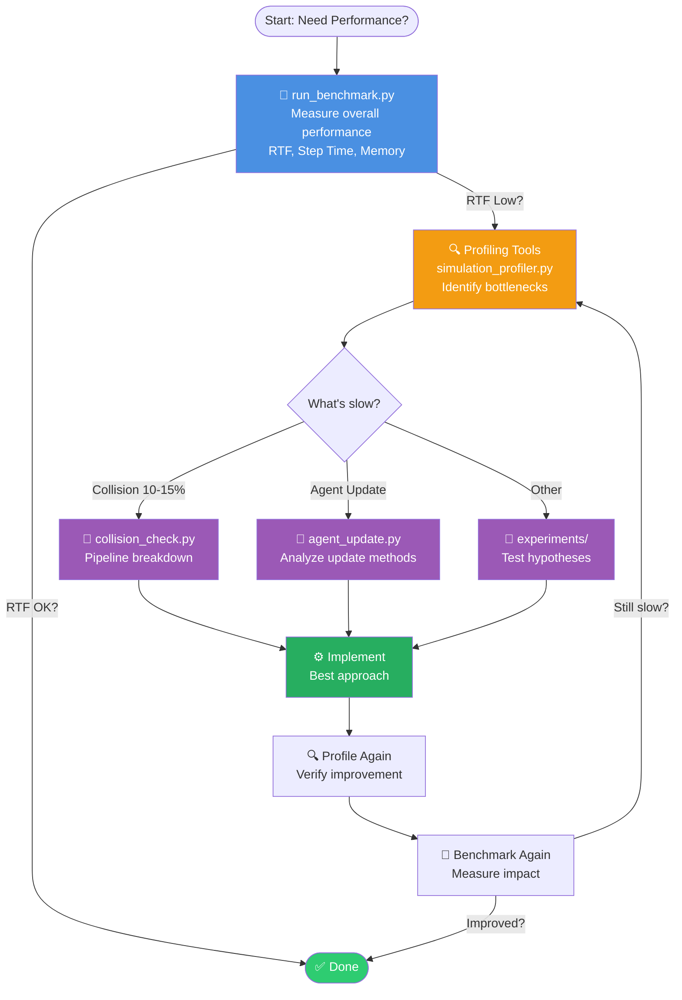

# PyBullet Fleet - Performance Benchmark Suite

This directory contains the benchmark scripts, profiling tools, experiment scripts, and configuration files for PyBulletFleet performance measurement and optimization. This file also renders as part of the project documentation on ReadTheDocs.

Last Updated: 2026-03-08

---

## Performance Optimization Workflow



### Typical Bottlenecks

| Symptom | Tool | Common Fix |
|---------|------|------------|
| Collision Check > 20% | `collision_check.py` | 2D collision mode (~67% reduction), reduce frequency to 10 Hz |
| Agent Update > 40% | `agent_update.py` | Skip stationary agents, reduce PyBullet API calls |
| Goal setting > 100ms | `agent_manager_set_goal.py` | Cache trajectory calculations |

### Tool Categories

- 🎯 **Benchmarking:** `run_benchmark.py`, `performance_benchmark.py` — measure overall performance
- 🔍 **Profiling:** `profiling/` — identify *what is slow* (see `profiling/README.md`)
- 🧪 **Experiments:** `experiments/` — compare *which is faster* (see `experiments/README.md`)

| | `profiling/` | `experiments/` |
|---|---|---|
| **Purpose** | Identify **what is slow** | Compare **which is faster** |
| **Scope** | Internal component breakdown | Algorithm / API alternative comparisons |
| **Output** | Time breakdown by component (%) | Method A vs Method B comparison table |

---

## Quick Start

```bash
# Single benchmark (1000 agents, 10s, 3 repetitions)
python benchmark/run_benchmark.py --agents 1000 --duration 10

# Multi-agent sweep
python benchmark/run_benchmark.py --sweep 100 500 1000 2000 5000

# Scenario comparison
python benchmark/run_benchmark.py --compare no_collision collision_2d_10hz collision_3d_full --agents 1000

# Identify bottleneck
python benchmark/profiling/simulation_profiler.py --agents=1000 --steps=100

# Drill into collision detection
python benchmark/profiling/collision_check.py --agents=1000

# Drill into agent update
python benchmark/profiling/agent_update.py --agents=1000 --test=cprofile
```

---

## Benchmark Results

### TL;DR

| Agents | RTF (×) | Step Time (ms) | Collisions Scale |
|--------|---------|-----------------|------------------|
| 100    | 46.0    | 2.2             | Excellent        |
| 500    | 7.1     | 14.1            | Good             |
| 1000   | 3.1     | 32.0            | Good             |
| 2000   | 1.2     | 84.6            | Real-time limit  |

**Real-Time Factor (RTF):** How many seconds of simulation time per 1 second of wall-clock time (higher is better; >1.0 = faster than real-time).

**Assessment:** ✅ Excellent: RTF > 2.0 · ⚠️ Good: RTF 1.0 – 2.0 · ❌ Poor: RTF < 1.0

All runs use kinematics mode (physics OFF), headless (DIRECT), half of agents moving.

### Test Environment

- **CPU**: Intel Core i7-1185G7 (11th Gen, 4C/8T, 3.0 GHz / 4.8 GHz turbo)
- **Memory**: 32 GB RAM
- **OS**: Ubuntu 20.04.1 LTS (Linux 5.15.0-139-generic)
- **Python**: 3.8.10, PyBullet latest
- **Mode**: DIRECT (headless), kinematics
- **Methodology**: 3 repetitions, 10 s duration each, mean ± std reported

### Performance Summary

> **Script:** `run_benchmark.py --sweep 100 250 500 1000 2000 --duration 10 --repetitions 3`

| Agents | RTF (×) | Step Time (ms) | Spawn Time (s) | Memory Delta (MB) |
|--------|---------|----------------|------------------|--------------------|
| 100    | 46.03±4.06 | 2.17±0.18  | 0.026±0.001      | −23.83±0.06        |
| 250    | 16.12±1.41 | 6.20±0.50  | 0.062±0.001      | −19.68±0.09        |
| 500    | 7.11±0.11  | 14.06±0.22 | 0.128±0.004      | −12.12±0.02        |
| 1000   | 3.12±0.09  | 32.04±0.87 | 0.254±0.003      | 3.04±0.20          |
| 2000   | 1.18±0.02  | 84.63±1.72 | 0.653±0.051      | 29.52±0.02         |

Negative memory delta = OS page-cache effects (process used less than baseline).

### Component Breakdown

> **Script:** `profiling/simulation_profiler.py` (1000 agents, 100 steps)

| Component        | Time (ms) | Share (%) |
|------------------|-----------|-----------|
| Agent Update     | 13.79     | 88.2      |
| Collision Check  | 1.76      | 11.2      |
| Monitor Update   | 0.08      | 0.5       |
| Step Simulation  | 0.00      | 0.0       |
| **Total**        | **15.63** | **100.0** |

Agent Update dominates (path-following, velocity computation, `resetBasePositionAndOrientation()` per agent per step). Step Simulation is 0 ms because `physics=false`.

### Scaling Analysis

> **Script:** Same sweep as Performance Summary above (`run_benchmark.py --sweep`)

```text
Agents:     100  →   250  →   500  →  1000  →  2000
Step (ms):  2.17 →  6.20 → 14.06 → 32.04 → 84.63
Ratio:      1.0x →  2.9x →  6.5x → 14.8x → 39.0x
```

- **Step Time:** ~O(n^1.3). Near-linear below 500 agents; super-linear above due to collision-pair density.
- **Spawn Time:** Linear (~0.25 ms per agent).
- **Memory:** Linear above ~500 agents (~20 KB per agent).

*Data collected 2026-03-08 on the test environment described above.*

---

## Directory Structure

```
benchmark/
├── README.md                          # This file (overview + results)
│
├── configs/                           # Benchmark-specific YAML configurations
│   ├── general.yaml                   # General performance benchmark (default)
│   ├── collision_physics_off.yaml     # Physics OFF + closest_points (recommended)
│   ├── collision_physics_on.yaml      # Physics ON + contact_points
│   └── collision_hybrid.yaml          # Physics ON + hybrid mode
│
├── results/                           # JSON output files
│
├── performance_benchmark.py           # Worker: single benchmark execution
├── run_benchmark.py                   # Orchestrator: multi-run, sweep, comparison
│
├── profiling/                         # Profiling tools → see profiling/README.md
│   ├── README.md
│   ├── simulation_profiler.py         # step_once() component breakdown
│   ├── collision_check.py             # Collision pipeline 4-stage analysis
│   ├── agent_update.py                # Agent.update() detailed analysis
│   ├── agent_manager_set_goal.py      # set_goal_pose() profiling
│   └── profiling_config.yaml          # Shared profiling configuration
│
├── experiments/                       # Experiment scripts → see experiments/README.md
│   ├── README.md
│   ├── collision_detection_methods_benchmark.py
│   ├── collision_methods_config_based.py
│   ├── collision_method_comparison.py
│   ├── collision_mode_comparison.py   # NORMAL_3D vs NORMAL_2D vs DISABLED
│   ├── performance_analysis.py
│   ├── list_filtering_benchmark.py
│   └── getaabb_performance.py
│
└── archive/                           # Deprecated tools
    ├── collision_check_v1.py
    ├── parse_profile.py
    ├── simple_agent_profile.py
    └── update_benchmark.py
```

---

## Architecture: Worker + Orchestrator Pattern

### **Worker** (`performance_benchmark.py`)
- Executes a single benchmark test
- Loads YAML config, runs simulation, measures RTF / step time / memory
- Outputs JSON to stdout
- Each test runs in a separate process for clean memory state

### **Orchestrator** (`run_benchmark.py`)
- Spawns worker processes, aggregates results
- **Modes:** Single Test · Sweep (multiple agent counts) · Compare (multiple scenarios)
- Computes statistics (median, mean, stdev) and generates comparison tables

### CLI Reference

```bash
# Single test
python benchmark/run_benchmark.py --agents 1000 --scenario no_collision

# Sweep
python benchmark/run_benchmark.py --sweep 100 500 1000 2000

# Compare scenarios
python benchmark/run_benchmark.py --compare no_collision collision_2d_10hz collision_3d_full --agents 1000

# Worker (direct, usually called by orchestrator)
python benchmark/performance_benchmark.py --agents 1000 --duration 10 --scenario no_collision
```

**Output Files:**
- `benchmark_results_<agents>agents_<duration>s_<scenario>.json`
- `benchmark_sweep_<duration>s.json`
- `benchmark_compare_<agents>agents_<duration>s.json`

---

## Benchmark Configs

All config files in `benchmark/configs/` share these common settings:

```yaml
target_rtf: 0              # Maximum speed (no sleep)
gui: false                  # Headless
enable_time_profiling: true # Profiling enabled
log_level: error            # Suppress logs
```

| Config | Physics | Detection Method | Collision Margin | Timestep |
|--------|---------|-----------------|-----------------|----------|
| `general.yaml` | OFF | — | — | 0.1 (10 Hz) |
| `collision_physics_off.yaml` | OFF | `closest_points` | 0.02 (2 cm) | 0.00417 (240 Hz) |
| `collision_physics_on.yaml` | ON | `contact_points` | 0.0 | 0.00417 (240 Hz) |
| `collision_hybrid.yaml` | ON | `hybrid` | 0.02 (2 cm) | 0.00417 (240 Hz) |

**Recommendation:** Use `collision_physics_off.yaml` for production workloads (fastest, deterministic).

---

## Further Reading

- **Profiling Guide** (`profiling/README.md`) — Detailed tool documentation, measurement methods, troubleshooting
- **Experiments Guide** (`experiments/README.md`) — Algorithm and API comparison scripts
- **Optimization Guide** (`docs/benchmarking/optimization-guide.md`) — Parameter tuning, configuration examples, use case recommendations

**Last Updated:** 2026-03-08
