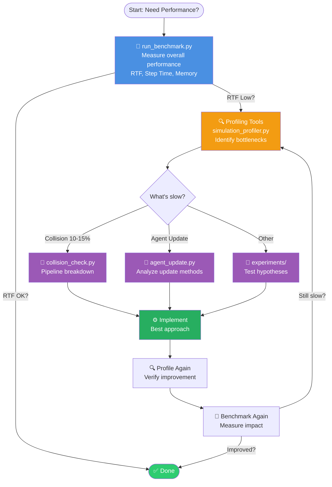

# PyBullet Fleet - Performance Benchmark Suite

This directory contains the benchmark scripts, profiling tools, experiment scripts, and configuration files for PyBulletFleet performance measurement and optimization. This file also renders as part of the project documentation on ReadTheDocs.

Last Updated: 2026-07-24

---

## Performance Optimization Workflow


```mermaid
flowchart TD
    Start([Start: Need Performance?]) --> Benchmark

    Benchmark[🎯 run_benchmark.py<br/>Measure overall performance<br/>RTF, Step Time, Memory]

    Benchmark -->|RTF OK?| Done([✅ Done])
    Benchmark -->|RTF Low?| Profile

    Profile[🔍 Profiling Tools<br/>simulation_profiler.py<br/>Identify bottlenecks]

    Profile --> Analyze{What's slow?}

    Analyze -->|Collision 10-15%| CollisionExp[🧪 collision_check.py<br/>Pipeline breakdown]
    Analyze -->|Agent Update| AgentExp[🧪 agent_update.py<br/>Analyze update methods]
    Analyze -->|Other| GenericExp[🧪 experiments/<br/>Test hypotheses]

    CollisionExp --> Implement[⚙️ Implement<br/>Best approach]
    AgentExp --> Implement
    GenericExp --> Implement

    Implement --> Profile2[🔍 Profile Again<br/>Verify improvement]
    Profile2 --> Benchmark2[🎯 Benchmark Again<br/>Measure impact]
    Benchmark2 -->|Improved?| Done
    Benchmark2 -->|Still slow?| Profile

    style Benchmark fill:#4A90E2,color:#fff
    style Profile fill:#F39C12,color:#fff
    style CollisionExp fill:#9B59B6,color:#fff
    style AgentExp fill:#9B59B6,color:#fff
    style GenericExp fill:#9B59B6,color:#fff
    style Implement fill:#27AE60,color:#fff
    style Done fill:#2ECC71,color:#fff
```

### Typical Bottlenecks

| Symptom | Tool | Common Fix |
|---------|------|------------|
| Collision Check > 20% | `collision_check.py` | 2D collision mode (~67% reduction), reduce frequency to 10 Hz |
| Agent Update > 40% | `agent_update.py` | Skip stationary agents, reduce PyBullet API calls |
| Goal setting > 100ms | `agent_manager_set_goal.py` | Cache trajectory calculations |
| Joint Update slow | `arm_joint_update.py` | Compare physics vs kinematic mode |

### Tool Categories

- 🎯 **Benchmarking:** `run_benchmark.py`, `mobile_benchmark.py`, `arm_benchmark.py` — measure overall performance (RTF, step time, memory)
- ⚡ **Controller comparison:** `run_benchmark.py --type mobile --controller ... --command-interface ...`, `batch_perf.py` — controller and command-interface timing with phase breakdown
- 🔍 **Profiling:** `profiling/` — identify *what is slow* (see `profiling/README.md`)
- 🧪 **Experiments:** `experiments/` — compare *which is faster* (see `experiments/README.md`)

| | `profiling/` | `experiments/` |
|---|---|---|
| **Purpose** | Identify **what is slow** | Compare **which is faster** |
| **Scope** | Internal component breakdown | Algorithm / API alternative comparisons |
| **Output** | Time breakdown by component (%) | Method A vs Method B comparison table |

---

## Quick Start

```bash
# Mobile: single benchmark (1000 agents, 10s, 3 repetitions)
# Uses the default overall-performance path from benchmark/configs/general.yaml:
# batch controller + fleet command interface.
python benchmark/run_benchmark.py --agents 1000 --duration 10

# Mobile: multi-agent sweep
python benchmark/run_benchmark.py --sweep 100 500 1000 2000 5000

# Mobile: scenario comparison
python benchmark/run_benchmark.py --compare no_collision collision_10hz collision_3d_full --agents 1000

# Mobile controller and command-ingress comparison.
python benchmark/run_benchmark.py --type mobile_control_path \
  --controller per_agent batch --command-interface per_agent fleet --agents 1000 --steps 600
python benchmark/run_benchmark.py --type mobile_control_path \
  --controller batch --command-interface per_agent fleet --sweep 100 500 1000 2000 --steps 300
python benchmark/run_benchmark.py --type mobile_control_path \
  --controller batch --command-interface fleet --agents 1000 --steps 300 --collision-freq 0
python benchmark/batch_perf.py --agents 1000 --mode omni
python benchmark/batch_perf.py --agents 1000 --mode omni \
  --controller per_agent batch --command-interface per_agent fleet

# Arm: single benchmark (10 arms, physics mode)
python benchmark/run_benchmark.py --type arm --agents 10 --duration 5 --scenario physics

# Arm: sweep arm counts (physics + kinematic)
python benchmark/run_benchmark.py --type arm --sweep 1 10 50 100

# Identify bottleneck (mobile)
python benchmark/profiling/simulation_profiler.py --agents=1000 --steps=100

# Identify bottleneck (arm)
python benchmark/profiling/arm_joint_update.py --arms=10 --steps=100

# Drill into collision detection
python benchmark/profiling/collision_check.py --agents=1000

# Drill into agent update (mobile)
python benchmark/profiling/agent_update.py --agents=1000 --test=cprofile
```

---

## Benchmark Results

### TL;DR

| Agents | RTF (×) | Step Time (ms) |
|--------|---------|----------------|
| 100    | 143.5   | 0.7            |
| 500    | 23.5    | 4.2            |
| 1000   | 10.1    | 9.9            |
| 2000   | 4.3     | 23.3           |

**Real-Time Factor (RTF):** How many seconds of simulation time per 1 second of wall-clock time (higher is better; >1.0 = faster than real-time).

**Assessment:** ✅ Excellent: RTF > 2.0 · ⚠️ Good: RTF 1.0 – 2.0 · ❌ Poor: RTF < 1.0

All measured runs use lightweight `simple_cube` robots, kinematics mode
(physics OFF), headless (DIRECT), half of agents moving, batch controller, and
fleet command interface.
The default `collision_check_frequency=null` setting means collision checks run
every simulation step.
More detailed robot models have higher spawn and update costs and should be
benchmarked separately from this large-scale baseline.
Timed simulation runs keep `tracemalloc` disabled because Python allocation
tracing materially distorts step-time and RTF measurements; memory deltas are
RSS-based.

### Test Environment

- **CPU**: AMD Ryzen AI 7 PRO 350 w/ Radeon 860M (8C/16T)
- **Memory**: 29 GB RAM
- **OS**: Ubuntu 24.04 on WSL2 (Linux 6.6 microsoft-standard-WSL2)
- **Python**: 3.12.3, PyBullet build time Jul 4 2026
- **Mode**: DIRECT (headless), kinematics
- **Methodology**: 3 repetitions, 10 s duration each, median ± stdev reported

### Performance Summary

> **Script:** `run_benchmark.py --sweep 100 250 500 1000 2000 --duration 10 --repetitions 3`

| Agents | RTF (×) | Step Time (ms) | Spawn Time (s) | Memory Delta (MB) |
|--------|---------|----------------|------------------|--------------------|
| 100    | 143.46±14.49 | 0.70±0.06  | 0.059±0.004      | +2.55±0.00         |
| 250    | 56.82±3.89   | 1.76±0.12  | 0.140±0.004      | +6.24±0.01         |
| 500    | 23.54±1.81   | 4.25±0.30  | 0.294±0.011      | +12.53±0.10        |
| 1000   | 10.12±0.08   | 9.88±0.08  | 0.604±0.038      | +25.00±0.02        |
| 2000   | 4.30±0.19    | 23.25±1.07 | 1.241±0.023      | +48.07±0.06        |

Memory delta is process RSS and should be treated as environment-dependent,
especially on WSL2.

### Component Breakdown

> **Script:** supplemental profiling with 1000 agents, 50% moving,
> `collision_check_frequency=null` (collision checks every simulation step), and
> the first 100 measured steps after warmup.

| Component | Mean Time | Share |
|-----------|-----------|-------|
| Agent / controller update | 4.43 ms | ~46% |
| Pose flush | 0.98 ms | ~10% |
| AABB / spatial-grid flush | 2.07 ms | ~22% |
| Collision check | 2.07 ms | ~22% |
| Monitor update | 0.04 ms | <1% |
| Step simulation | 0 ms | 0% |

Moving-agent update is the largest component, while AABB/grid refresh and
collision checking together are comparable. Step Simulation is 0 ms because
`physics=false`.

### Scaling Analysis

> **Script:** Same sweep as Performance Summary above (`run_benchmark.py --sweep`)

```text
Agents:     100  →  250  →  500  → 1000  → 2000
Step (ms):  0.70 → 1.76 → 4.25 → 9.88 → 23.25
Ratio:      1.0x → 2.5x → 6.1x → 14.1x → 33.2x
```

- **Step Time:** ~O(n^1.2) across the measured 100-2000 robot sweep on this WSL2 host.
- **Spawn Time:** Linear (~0.25 ms per agent).
- **Memory:** Linear above ~500 agents (~20 KB per agent).

*Rows collected 2026-07-24 on the test environment described above.*

### Mobile Control Path Comparison

> **Script:** `run_benchmark.py --type mobile_control_path --controller per_agent batch --command-interface per_agent fleet --sweep 100 500 1000 --steps 600 --repetitions 3`

This benchmark isolates controller update and command-ingress cost in the
Python simulation loop.

| Agents | Controller | Command Interface | Setup Time (s) | Step Time (ms) | P95 Step (ms) |
|--------|------------|-------------------|----------------|----------------|---------------|
| 100    | per-agent  | per-agent         | 0.0020         | 0.118          | 0.149         |
| 100    | batch      | fleet             | 0.0016         | 0.112          | 0.124         |
| 500    | per-agent  | per-agent         | 0.0283         | 0.666          | 0.563         |
| 500    | batch      | fleet             | 0.0082         | 0.661          | 0.383         |
| 1000   | per-agent  | per-agent         | 0.0245         | 1.526          | 1.592         |
| 1000   | batch      | fleet             | 0.0162         | 1.290          | 1.397         |

---

## Directory Structure

```
benchmark/
├── README.md                          # This file (overview + results)
│
├── tools.py                           # Shared benchmark helpers (system info, memory, cleanup)
│
├── configs/                           # Benchmark-specific YAML configurations
│   ├── general.yaml                   # General performance benchmark (default)
│   ├── collision_physics_off.yaml     # Physics OFF + closest_points (recommended)
│   ├── collision_physics_on.yaml      # Physics ON + contact_points
│   └── collision_hybrid.yaml          # Physics ON + hybrid mode
│
├── results/                           # JSON output files
│
├── mobile_benchmark.py                # Worker: mobile agent benchmark
├── arm_benchmark.py                   # Worker: arm robot benchmark
├── run_benchmark.py                   # Orchestrator: --type mobile|arm, sweep, comparison
│
├── profiling/                         # Profiling tools → see profiling/README.md
│   ├── README.md
│   ├── simulation_profiler.py         # step_once() component breakdown
│   ├── collision_check.py             # Collision pipeline 4-stage analysis
│   ├── agent_update.py                # Agent.update() detailed analysis (mobile)
│   ├── arm_joint_update.py            # Arm joint update profiling (physics vs kinematic)
│   ├── agent_manager_set_goal.py      # set_goal_pose() profiling
│   ├── wrapper_overhead.py            # Wrapper overhead: PyBullet vs SimObject vs Agent
│   └── profiling_config.yaml          # Shared profiling configuration
│
├── experiments/                       # Experiment scripts → see experiments/README.md
│   ├── README.md
│   ├── collision_methods_config_based.py
│   ├── collision_method_comparison.py
│   └── collision_mode_comparison.py   # NORMAL_3D vs NORMAL_2D vs DISABLED
│
└── archive/                           # Deprecated tools (superseded scripts)
```

---

## Architecture: Worker + Orchestrator Pattern

### **Workers** (`mobile_benchmark.py`, `arm_benchmark.py`)
- Each executes a single benchmark test in a clean process
- Mobile worker: loads YAML config, spawns cube agents, runs simulation
- Arm workers: spawns arm robots with JointAction sequences (physics or kinematic)
- Both output JSON to stdout
- Process isolation ensures clean memory state between runs

The default mobile worker path is configured in `benchmark/configs/general.yaml`
as `agents.batch_controller: batch_omni` and `agents.command_interface: fleet`.
Override those fields in a scenario or custom config when you need the legacy
per-agent path for comparison. `--collision-freq` can override the config value
for mobile, arm, and mobile control-path runs.

### **Shared Helpers** (`tools.py`)
- `get_system_info()` — CPU, memory, OS detection
- `get_memory_info()` — RSS + tracemalloc measurement
- `force_cleanup()`, `cpu_time_s()`, `ensure_disconnected()`, `warmup_steps()`

### **Orchestrator** (`run_benchmark.py`)
- Spawns worker processes, aggregates results
- `--type mobile` (default): mobile agent benchmarks
- `--type arm`: arm robot benchmarks (supports `--scenario physics|kinematic`)
- `--type mobile --controller ... --command-interface ...`: separate comparison axes
  for controller implementation (`per_agent`, `batch`) and command interface
  (`per_agent`, `fleet`)
- **Modes:** Single Test · Sweep (multiple counts) · Compare (multiple scenarios)
- Computes statistics (median, mean, stdev) and generates comparison tables

### CLI Reference

```bash
# Mobile: single test
python benchmark/run_benchmark.py --agents 1000 --scenario no_collision

# Mobile: sweep
python benchmark/run_benchmark.py --sweep 100 500 1000 2000

# Mobile: compare scenarios
python benchmark/run_benchmark.py --compare no_collision collision_2d_10hz --agents 1000

# Arm: single test
python benchmark/run_benchmark.py --type arm --agents 10 --scenario physics

# Arm: sweep (physics + kinematic)
python benchmark/run_benchmark.py --type arm --sweep 1 10 50 100

# Workers (direct, usually called by orchestrator)
python benchmark/mobile_benchmark.py --agents 1000 --duration 10 --scenario no_collision
python benchmark/arm_benchmark.py --agents 10 --duration 5 --scenario physics
```

**Output Files:**
- Mobile: `benchmark_results_<agents>agents_<duration>s.json`, `benchmark_sweep_<duration>s.json`
- Arm: `arm_results_<arms>arms_<duration>s.json`, `arm_sweep_<duration>s.json`

---

## Benchmark Configs

All config files in `benchmark/configs/` share these common settings:

```yaml
target_rtf: 0              # Maximum speed (no sleep)
gui: false                  # Headless
enable_time_profiling: true # Profiling enabled
log_level: error            # Suppress logs
```

| Config | Physics | Detection Method | Collision Margin | Timestep |
|--------|---------|-----------------|-----------------|----------|
| `general.yaml` | OFF | — | — | 0.1 (10 Hz) |
| `collision_physics_off.yaml` | OFF | `closest_points` | 0.02 (2 cm) | 0.00417 (240 Hz) |
| `collision_physics_on.yaml` | ON | `contact_points` | 0.0 | 0.00417 (240 Hz) |
| `collision_hybrid.yaml` | ON | `hybrid` | 0.02 (2 cm) | 0.00417 (240 Hz) |

**Recommendation:** Use `collision_physics_off.yaml` for production workloads (fastest, deterministic).

### Scenarios (`general.yaml`)

Each config file can define named scenarios under a `scenarios:` key.  A scenario
overrides only the fields it specifies; everything else falls back to the top-level
defaults.  Pass a scenario name with `--scenario` or `--compare`:

| Scenario | Description |
|----------|-------------|
| `no_collision` | Collision disabled — isolates controller overhead |
| `collision_3d_full` | Full 3D collision every step |
| `collision_10hz` | 3D collision at 10 Hz |
| `stress_5k_agents` | 5 000 agents, single run |
| `per_agent` | Per-agent controllers, no collision — for batch comparison |
| `batch_omni` | BatchOmniController, no collision — for batch comparison |

> **Minimum step count:** `general.yaml` uses `timestep=0.1 s`.  With `--duration 5`
> only 50 steps are measured — a single GC pause can skew the mean 10×.  Use
> `--duration 30` (300 steps) or longer for stable results.

---

## Further Reading

- **Profiling Guide** (`profiling/README.md`) — Detailed tool documentation, measurement methods, troubleshooting
- **Experiments Guide** (`experiments/README.md`) — Algorithm and API comparison scripts
- **Optimization Guide** (`docs/benchmarking/optimization-guide.md`) — Parameter tuning, configuration examples, use case recommendations

**Last Updated:** 2026-07-24
