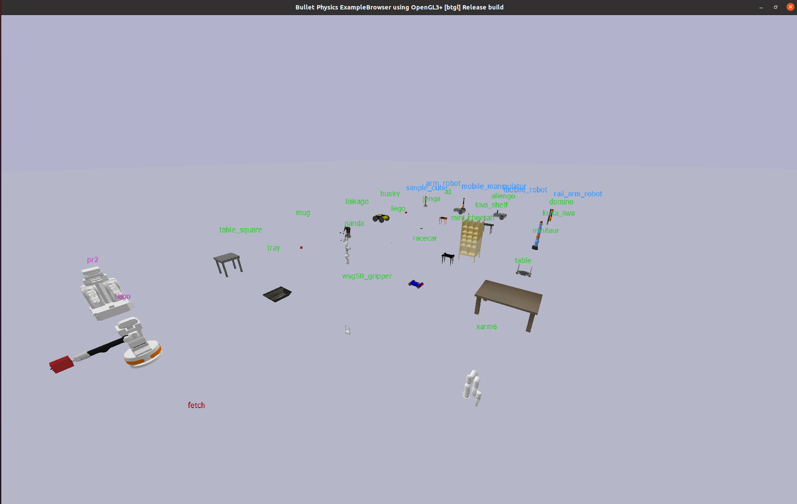
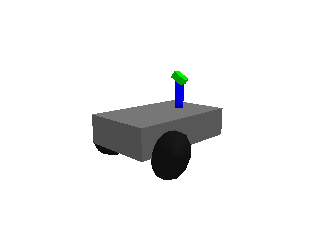
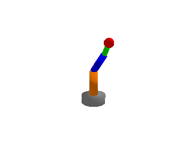
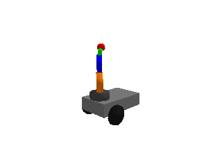
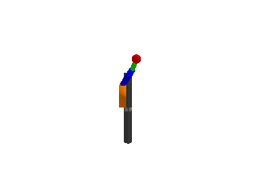

# Tutorial 6: Robot Models — resolve_urdf & Model Catalog



**Source files:** [`examples/models/`](https://github.com/yuokamoto/PyBulletFleet/tree/main/examples/models)

This tutorial shows how to load robots **by name** instead of by file path,
browse the model catalog, and inspect robot capabilities automatically.

**What you'll learn:**

- Resolving a model name to a URDF path with `resolve_urdf()`
- How `Agent.from_urdf()` accepts model names directly
- Auto-detecting robot type, joints, and EE with `auto_detect_profile()`
- Listing all available models with `list_all_models()`
- Using third-party models from `pybullet_data` and `robot_descriptions`

**No prerequisites** — this tutorial is self-contained and can be read at any point.

---

## 1. Loading Robots by Name

Traditionally you pass a file path to `Agent.from_urdf()`:

```python
agent = Agent.from_urdf(
    urdf_path="robots/arm_robot.urdf",
    pose=Pose.from_xyz(0, 0, 0),
    sim_core=sim,
)
```

With model name resolution, you can simply pass a **name**:

```python
agent = Agent.from_urdf(
    urdf_path="panda",       # resolved automatically
    pose=Pose.from_xyz(0, 0, 0),
    use_fixed_base=True,
    sim_core=sim,
)
```

`Agent.from_urdf()` calls `resolve_urdf()` internally.  The name `"panda"` is
looked up in the `KNOWN_MODELS` registry and resolved to the absolute URDF path
from `pybullet_data`.

---

## 2. How `resolve_urdf()` Works

`resolve_urdf()` searches through **tiers** in priority order:

| Tier | Source | Example names |
|------|--------|---------------|
| 0 — `local` | `robots/` directory in the project | `arm_robot`, `mobile_robot`, `simple_cube` |
| 1 — `pybullet_data` | PyBullet's bundled data directory | `panda`, `kuka_iiwa`, `r2d2` |
| 2 — `ros` | ROS install paths (`$AMENT_PREFIX_PATH`) | `ur5e`, `turtlebot3_burger` |
| 3 — `robot_descriptions` | `robot_descriptions` pip package | `tiago`, `pr2` |

`KNOWN_MODELS` is a **curated subset** of each tier.  However, models **not** in
the registry are still resolved automatically — `resolve_urdf()` falls back to
scanning installed packages:

1. User search paths (`add_search_path()`)
2. `KNOWN_MODELS` registry (curated)
3. **Auto-discovery:** scans `pybullet_data` directory by filename stem
4. **Auto-discovery:** scans `robot_descriptions` modules with `URDF_PATH`
5. `FileNotFoundError`

```python
# Works even though "r2d2" is not in KNOWN_MODELS —
# auto-discovered from pybullet_data
resolve_urdf("r2d2")

# Works if robot_descriptions is installed —
# auto-discovered from anymal_b_description module
resolve_urdf("anymal_b")
```

```{tip}
Auto-discovery scans lazily and caches results.  The `pybullet_data` scan is
fast (cached after first miss).  The `robot_descriptions` scan is slower
because it imports each module (which may trigger a git clone on first access).
```

**Direct paths pass through unchanged.** Any string containing `/` or ending in
`.urdf` / `.sdf` is returned as-is without tier lookup.

```python
from pybullet_fleet.robot_models import resolve_urdf

# Tier 0 — local robots/ dir
resolve_urdf("arm_robot")
# → /path/to/PyBulletFleet/robots/arm_robot.urdf

# Tier 1 — pybullet_data
resolve_urdf("panda")
# → /path/to/pybullet_data/franka_panda/panda.urdf

# Direct path — pass through
resolve_urdf("robots/mobile_robot.urdf")
# → robots/mobile_robot.urdf
```

---

## 3. Listing All Models

### Local Models (project `robots/` directory)

| Model | Preview |
|-------|---------|
| mobile_robot |  |
| arm_robot |  |
| simple_cube |  |
| mobile_manipulator |  |
| rail_arm_robot |  |

### Third-Party Models

Models from `pybullet_data` (always available), ROS packages, and
`robot_descriptions` are also registered.  Use `list_all_models()` to check
availability.

| Name | Tier | Category |
|------|------|----------|
| `panda` | pybullet_data | Arm |
| `kuka_iiwa` | pybullet_data | Arm |
| `xarm6` | pybullet_data | Arm |
| `husky` | pybullet_data | Mobile |
| `racecar` | pybullet_data | Mobile |
| `a1` | pybullet_data | Quadruped |
| `laikago` | pybullet_data | Quadruped |
| `aliengo` | pybullet_data | Quadruped |
| `mini_cheetah` | pybullet_data | Quadruped |
| `minitaur` | pybullet_data | Quadruped |
| `wsg50_gripper` | pybullet_data | Gripper |
| `table` | pybullet_data | Object |
| `table_square` | pybullet_data | Object |
| `tray` | pybullet_data | Object |
| `kiva_shelf` | pybullet_data | Object |
| `plane` | pybullet_data | Object |
| `domino` | pybullet_data | Object |
| `jenga` | pybullet_data | Object |
| `lego` | pybullet_data | Object |
| `mug` | pybullet_data | Object |
| `ur5e` | ros | Arm |
| `turtlebot3_burger` | ros | Mobile |
| `turtlebot3_waffle` | ros | Mobile |
| `fetch` | ros | Mobile Manipulator |
| `tiago` | robot_descriptions | Mobile Manipulator |
| `pr2` | robot_descriptions | Mobile Manipulator |

```{tip}
Generate preview images for all models locally with
`python scripts/capture_model_catalog.py`.  Output goes to `docs/media/models/`.
```

Use `list_all_models()` to see every registered model with its tier and availability:

```python
from pybullet_fleet.robot_models import list_all_models

models = list_all_models()
for name, info in models.items():
    available = "✓" if info["available"] else "✗"
    print(f"  {name:<20} {info['tier']:<20} {available}")
```

Or from the command line:

```bash
python examples/models/resolve_urdf_demo.py --list
```

---

## 4. Auto-Detecting Robot Capabilities

`auto_detect_profile()` inspects a loaded robot body and returns a `RobotProfile`
dataclass containing type classification, joint information, and end-effector detection:

```python
from pybullet_fleet.robot_models import auto_detect_profile

# Pass a body_id (int) for already-loaded robots — most efficient
profile = auto_detect_profile(agent.body_id, sim.client)

print(profile.robot_type)          # "arm", "mobile", "mobile_manipulator", or "static"
print(profile.num_joints)          # total joint count
print(profile.movable_joint_names) # names of non-fixed joints
print(profile.ee_link_name)        # detected end-effector link
print(profile.joint_lower_limits)  # per-joint lower limits
print(profile.joint_upper_limits)  # per-joint upper limits
```

`auto_detect_profile()` also accepts a URDF path string — it will load the robot
temporarily, inspect it, and remove it. Prefer passing `body_id` (int) when the
robot is already spawned to avoid the load/remove overhead.

---

## 5. Using Third-Party Models

### Registered models (in `KNOWN_MODELS`)

Models listed in `KNOWN_MODELS` can be loaded by name:

```python
# Tier 1 — pybullet_data (always available)
agent = Agent.from_urdf(urdf_path="panda", pose=Pose.from_xyz(0, 0, 0),
                        use_fixed_base=True, sim_core=sim)

# Tier 2 — ROS (requires package installed)
agent = Agent.from_urdf(urdf_path="ur5e", pose=Pose.from_xyz(0, 0, 0),
                        use_fixed_base=True, sim_core=sim)

# Tier 3 — robot_descriptions (requires pip install)
agent = Agent.from_urdf(urdf_path="tiago", pose=Pose.from_xyz(0, 0, 0),
                        sim_core=sim)
```

Run `resolve_urdf_demo.py --list` or call `list_all_models()` to see
all registered names and their availability.

(using-unlisted-models)=
### Auto-discovery of unlisted models

`KNOWN_MODELS` is a curated set, but models **not** in the registry are still
usable by name — `resolve_urdf()` automatically scans installed packages as a
fallback:

```python
# "r2d2" is NOT in KNOWN_MODELS, but exists in pybullet_data
# → auto-discovered on first call, then cached
agent = Agent.from_urdf(urdf_path="r2d2", pose=Pose.from_xyz(0, 0, 0),
                        sim_core=sim)

# "anymal_b" is NOT in KNOWN_MODELS, but robot_descriptions has it
# (requires: pip install robot_descriptions)
agent = Agent.from_urdf(urdf_path="anymal_b", pose=Pose.from_xyz(0, 0, 0),
                        sim_core=sim)
```

Auto-discovery works by:
1. Scanning `pybullet_data` directory for `{name}.urdf` / `{name}.sdf` (fast, cached)
2. Scanning `robot_descriptions` for `{name}_description` module with `URDF_PATH` (slower, lazy-loads)

Use `discover_models()` to see **all** discoverable models from a tier:

```python
from pybullet_fleet.robot_models import discover_models

# All ~1100 URDFs in pybullet_data
pb_models = discover_models("pybullet_data")
print(f"{len(pb_models)} models in pybullet_data")

# All ~87 URDF models in robot_descriptions
rd_models = discover_models("robot_descriptions")
print(f"{len(rd_models)} models in robot_descriptions")
```

### When auto-discovery isn't enough

For ROS packages or models whose filename doesn't match the desired name,
you can use direct paths or `register_model()`:

```python
# Option A: Direct file path
import pybullet_data
path = f"{pybullet_data.getDataPath()}/kuka_iiwa/model_vr_limits.urdf"
agent = Agent.from_urdf(urdf_path=path, sim_core=sim)

# Option B: register_model() for reusable short names
from pybullet_fleet.robot_models import register_model, ModelEntry
register_model("kuka_vr", ModelEntry("kuka_iiwa/model_vr_limits.urdf", "pybullet_data"))
agent = Agent.from_urdf(urdf_path="kuka_vr", sim_core=sim)

# Option C: ROS package → find via ament_index
from ament_index_python.packages import get_package_share_directory
path = f"{get_package_share_directory('my_robot_description')}/urdf/my_robot.urdf"
agent = Agent.from_urdf(urdf_path=path, sim_core=sim)
```

### Installing `robot_descriptions`

The `robot_descriptions` package provides 80+ robot URDFs:

```bash
pip install pybullet-fleet[models]
# or: pip install robot_descriptions
```

If the package is not installed, `resolve_urdf()` raises `FileNotFoundError` with
an install hint.

---

## 6. Runnable Demos

| Script | What it demonstrates |
|--------|---------------------|
| [`resolve_urdf_demo.py`](https://github.com/yuokamoto/PyBulletFleet/blob/main/examples/models/resolve_urdf_demo.py) | Three URDF resolution patterns: by name, by direct path, and listing all models |
| [`model_catalog_demo.py`](https://github.com/yuokamoto/PyBulletFleet/blob/main/examples/models/model_catalog_demo.py) | Visual grid catalog of all registered models from `KNOWN_MODELS` |
| [`robot_descriptions_demo.py`](https://github.com/yuokamoto/PyBulletFleet/blob/main/examples/models/robot_descriptions_demo.py) | Using Tier 3 models from the `robot_descriptions` pip package |

```bash
# Try it:
python examples/models/resolve_urdf_demo.py --robot panda
python examples/models/resolve_urdf_demo.py --list
python examples/models/model_catalog_demo.py
```

### The `--robot` Argument

Most example scripts across the project accept a `--robot` argument to swap the
robot model at runtime.  The value is passed to `resolve_urdf()`, so you can use
a registered model name or a direct URDF path — as long as the model is compatible
with the demo (e.g., arm models for arm demos, mobile models for mobile demos):

```bash
# Arm demos — pass arm models (default: panda)
python examples/arm/pick_drop_arm_demo.py --robot kuka_iiwa

# Mobile demos — pass mobile models (default: husky)
python examples/mobile/path_following_demo.py --robot racecar

# Scale demos
python examples/scale/100robots_cube_patrol_demo.py --robot mobile_robot
python examples/scale/pick_drop_arm_100robots_demo.py --robot kuka_iiwa

# Grid demo has both --robot (mobile) and --arm-robot (arm)
python examples/scale/100robots_grid_demo.py --robot racecar --arm-robot kuka_iiwa

# Model demos — accepts any registered model
python examples/models/robot_descriptions_demo.py --robot pr2
```

| Category | Argument | Default | Alternatives |
|----------|----------|---------|-------------|
| Arm demos (`examples/arm/`) | `--robot` | `panda` | `kuka_iiwa`, `arm_robot` |
| Mobile demos (`examples/mobile/`) | `--robot` | `husky` | `racecar`, `mobile_robot` |
| Scale demos — mobile | `--robot` | `husky` | `racecar`, `mobile_robot` |
| Scale demos — arm | `--robot` | `panda` | `kuka_iiwa`, `arm_robot` |
| `100robots_grid_demo.py` | `--robot` (mobile) | `husky` | `racecar`, `mobile_robot` |
| `100robots_grid_demo.py` | `--arm-robot` (arm) | `panda` | `kuka_iiwa`, `arm_robot` |
| `resolve_urdf_demo.py` | `--robot` | `panda` | any registered model |
| `robot_descriptions_demo.py` | `--robot` | `tiago` | any `robot_descriptions` model |

---

(custom-search-paths)=
## 7. Custom Search Paths

If your team maintains URDF files in a shared directory (e.g., `/opt/company_robots/`),
you can register it as a search path so `resolve_urdf()` finds them by name:

```python
from pybullet_fleet.robot_models import add_search_path, resolve_urdf

add_search_path("/opt/company_robots")

# Now resolves to /opt/company_robots/my_agv.urdf
agent = Agent.from_urdf(urdf_path="my_agv", sim_core=sim)
```

**Priority:** User search paths are checked **before** the built-in `KNOWN_MODELS`
registry, so you can shadow a built-in model with a custom version if needed.

**Resolution order for name-based lookup:**

1. User search paths (FIFO order) — looks for `{name}.urdf` or `{name}.sdf`
2. `KNOWN_MODELS` registry (Tier 0 → 3)
3. Auto-discovery: `pybullet_data` file scan (cached)
4. Auto-discovery: `robot_descriptions` module scan
5. `FileNotFoundError`

### API

| Function | Description |
|----------|-------------|
| `add_search_path(directory)` | Register a directory. Raises `ValueError` if it doesn't exist. Idempotent (duplicates ignored). |
| `remove_search_path(directory)` | Unregister a directory. No-op if not registered. |
| `get_search_paths()` | Return the current list of user search paths (copy). |
| `register_model(name, path_or_entry)` | Add a model to `KNOWN_MODELS`. Pass a path string or `ModelEntry`. Use `force=True` to overwrite. |
| `unregister_model(name)` | Remove a model from `KNOWN_MODELS`. No-op if not registered. |
| `discover_models(tier)` | Scan an entire tier (`"pybullet_data"` or `"robot_descriptions"`) and return all found models as `{name: path}`. |
