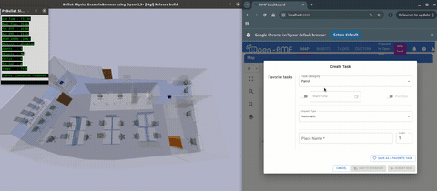
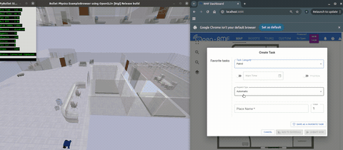
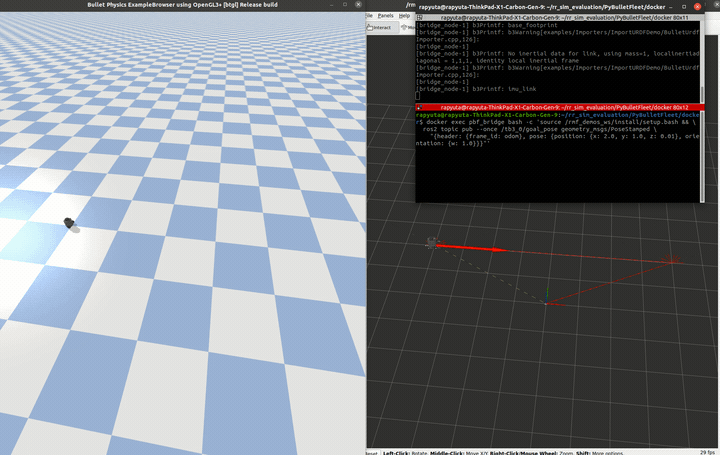
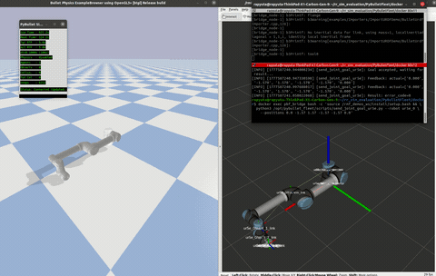

# ROS 2 Bridge & Open-RMF Integration

<p align="center">
<b>Office (Open-RMF)</b><br>

</p>
<p align="center">
<b>Hotel (Open-RMF)</b><br>

</p>
<p align="center">
<b>TurtleBot3 Demo</b><br>

</p>
<p align="center">
<b>UR5 Arm</b><br>

</p>

ROS 2 interface layer for [PyBulletFleet](../README.md).
Three packages provide a clean separation between general ROS 2 connectivity, Open-RMF integration, and custom message definitions.

| Package | Description |
|---------|-------------|
| **pybullet_fleet_ros** | General-purpose ROS 2 bridge — per-robot topics, action servers, services |
| **pybullet_fleet_rmf** | Open-RMF fleet adapter + door / lift / workcell handlers |
| **pybullet_fleet_msgs** | Custom message, service, and action definitions |

## Quick Start

For Docker-based setup, see **[docker/README.md](../docker/README.md)**. For a
native Ubuntu 24.04 + ROS 2 Jazzy workflow, see
**[NATIVE_ROS2.md](NATIVE_ROS2.md)**.

### Apt Package Boundary

The Jazzy ROS packages distribute the ROS interfaces, bridge node, and RMF
adapter packages. The simulation core remains the separately distributed
`pybullet-fleet` Python package because PyBullet is not available as a ROS
binary dependency. Install the core into the Python environment used to run
the ROS nodes before starting `bridge_node` or `fleet_adapter`.

The RMF package includes the PyBulletFleet adapter, door/lift handlers, and
launch files. The office, hotel, airport, clinic, campus, and battle-royale
launch files additionally require a source-built `rmf_demos` overlay that
provides `rmf_demos` and `rmf_demos_maps`. Those demo assets are not supplied
by the Jazzy binary packages. Follow [NATIVE_ROS2.md](NATIVE_ROS2.md) for the
native overlay setup, or use the Docker workflow for the fully provisioned
RMF demo environment.

Maintainers preparing a rosdistro or Bloom release should follow
[RELEASING.md](RELEASING.md).

### Jazzy Apt Installation

Install the ROS bridge package and the Python simulation core under the same
Unix account that will run `ros2`. Ubuntu 24.04 marks its system Python as
externally managed (PEP 668), so use the user site rather than a virtual
environment: ROS Python console scripts use `/usr/bin/python3` and cannot see
packages installed only in an activated virtual environment.

```bash
sudo apt update
sudo apt install -y \
  ros-jazzy-pybullet-fleet-ros \
  ros-jazzy-pybullet-fleet-msgs \
  python3-pip python3-dev build-essential
python3 -m pip install --user --break-system-packages pybullet-fleet
```

PyBullet currently builds from source on Python 3.12, which is why the C/C++
build prerequisites are included. Verify the runtime before launching a demo:

```bash
source /opt/ros/jazzy/setup.bash
python3 -c 'import pybullet, pybullet_fleet; print(pybullet.__file__)'
ros2 run pybullet_fleet_ros bridge_node --ros-args \
  -p config_yaml:="$(ros2 pkg prefix pybullet_fleet_ros)/share/pybullet_fleet_ros/config/bridge_test.yaml"
```

The bridge should report that it started with three robots; stop this smoke
test with `Ctrl-C`.

Install `ros-jazzy-pybullet-fleet-rmf` as well when using the RMF adapter. Its
runtime has the same `pybullet-fleet` prerequisite; the RMF demo launch files
still additionally require the `rmf_demos` source overlay described above.

### Documentation Map

Use this file as the ROS 2 bridge entry point. The repository keeps Docker
files under `docker/` because they build the whole ROS/RMF test environment,
but those Docker workflows are still part of the ROS 2 bridge documentation.

| Document | Scope |
|----------|-------|
| `ros2_bridge/README.md` | ROS 2 bridge architecture, interfaces, RMF client modes, and shared test matrix |
| `docker/README.md` | Docker image, compose commands, GUI/RViz forwarding, and Docker-specific demo commands |
| `ros2_bridge/NATIVE_ROS2.md` | Ubuntu 24.04 + ROS 2 Jazzy native setup, overlay build, and native test commands |

To avoid drift, shared concepts such as interface modes and test purpose should
live here. Environment-specific pages should focus on setup and command lines.

---

## pybullet_fleet_ros — ROS 2 Bridge

`bridge_node` creates a `RobotHandler` for each simulated robot, exposing standard ROS 2 interfaces.

### Per-Robot Topics

| Direction | Topic | Type | Description |
|-----------|-------|------|-------------|
| Pub | `/{robot}/odom` | `nav_msgs/Odometry` | Odometry + TF (`odom → base_link`) |
| Pub | `/{robot}/joint_states` | `sensor_msgs/JointState` | Joint positions / velocities |
| Pub | `/{robot}/plan` | `nav_msgs/Path` | Current planned path |
| Pub | `/{robot}/current_goal` | `geometry_msgs/PoseStamped` | Active navigation goal |
| Pub | `/{robot}/diagnostics` | `diagnostic_msgs/DiagnosticArray` | Robot diagnostics |
| Sub | `/{robot}/cmd_vel` | `geometry_msgs/Twist` | Velocity command |
| Sub | `/{robot}/goal_pose` | `geometry_msgs/PoseStamped` | Navigation goal (fire-and-forget) |
| Sub | `/{robot}/path` | `nav_msgs/Path` | Path to follow |
| Sub | `/{robot}/joint_trajectory` | `trajectory_msgs/JointTrajectory` | Joint trajectory command |
| Sub | `/{robot}/joint_commands` | `std_msgs/Float64MultiArray` | Direct joint position command |

### Fleet-Level Interfaces

| Direction | Topic/Service | Type | Description |
|-----------|---------------|------|-------------|
| Pub | `/fleet/states` | `pybullet_fleet_msgs/FleetState` | Batched robot state |
| Sub/Srv | `/fleet/navigate` | `pybullet_fleet_msgs/FleetNavigate` | Batched navigation command |
| Sub/Srv | `/fleet/stop` | `pybullet_fleet_msgs/FleetStop` | Batched stop command |
| Sub/Srv | `/fleet/attach` | `pybullet_fleet_msgs/FleetAttach` | Batched attach/detach command |
| Sub/Srv | `/fleet/execute_action` | `pybullet_fleet_msgs/FleetExecuteAction` | Batched generic action command |
| Sub/Srv | `/fleet/joint_command` | `pybullet_fleet_msgs/FleetJointCommand` | Batched joint position command |

Fleet command messages and service requests include `std_msgs/Header`.
`header.frame_id` names the command frame for pose-bearing commands, normally
`odom`; `header.stamp` is the caller's command issue time.
Per-robot `AttachObject` requests reuse `RobotAttachCommand`, and per-robot
`ExecuteActionGoal` requests wrap `RobotActionCommand`, so detailed attach and
generic action payloads stay aligned with their fleet-level equivalents.

### Per-Robot Action Servers

| Action Server | Type | Description |
|---------------|------|-------------|
| `/{robot}/navigate_to_pose` | `nav2_msgs/NavigateToPose` | Point-to-point navigation with feedback |
| `/{robot}/follow_path` | `nav2_msgs/FollowPath` | Path-following with feedback |
| `/{robot}/follow_joint_trajectory` | `control_msgs/FollowJointTrajectory` | Arm trajectory execution |
| `/{robot}/execute_action_blocking` | `pybullet_fleet_msgs/ExecuteAction` | Generic PyBulletFleet action (blocking) |

### Per-Robot Services

| Service | Type | Description |
|---------|------|-------------|
| `/{robot}/toggle_attach` | `std_srvs/SetBool` | Attach/detach nearest object |
| `/{robot}/attach_object` | `pybullet_fleet_msgs/AttachObject` | Attach specific object by name |

### Per-Robot Topics (fire-and-forget)

| Topic | Type | Description |
|-------|------|-------------|
| `/{robot}/execute_action` | `pybullet_fleet_msgs/ExecuteActionGoal` | Generic action (non-blocking) |

### Simulation Services

| Service | Description |
|---------|-------------|
| `/sim/spawn_entity` | Spawn robot or object |
| `/sim/delete_entity` | Remove entity |
| `/sim/get_entity_state` | Query pose of an entity |
| `/sim/set_entity_state` | Teleport entity |
| `/sim/get_entities` | List all entities |
| `/sim/get_entities_states` | Batch state query |
| `/sim/get_entity_info` | Entity metadata (URDF, type) |
| `/sim/get_entity_bounds` | AABB bounds |
| `/sim/step_simulation` | Advance simulation by N steps |
| `/sim/get_simulation_state` | Query sim state (paused, time, FPS) |
| `/sim/set_simulation_state` | Pause / resume / set speed |
| `/sim/reset_simulation` | Reset to initial state |
| `/sim/get_spawnables` | List available URDFs |
| `/sim/get_simulator_features` | Query supported features |
| `/sim/simulate_steps` | Step simulation (action, with feedback) |

### Test Layers

| Layer | Entry Point | Purpose |
|-------|-------------|---------|
| Core Python unit tests | `pytest tests/` | PyBulletFleet runtime behavior without ROS |
| ROS package tests | `colcon test` | Installed ROS package/unit behavior |
| Bridge API check | `docker/test_bridge_api.sh` | ROS bridge topics, services, fleet endpoints, and basic motion |
| RMF stack check | `docker/test_rmf_stack.sh` | RMF handlers/adapters launch and expose expected stack interfaces |
| RMF dispatch flow | `docker/test_rmf_dispatch.sh` | RMF dispatcher -> adapter -> bridge/plugin -> simulator task flow |
| RMF client-mode matrix | `docker/test_rmf_client_modes.sh` | `per_robot_ros`, `fleet_ros`, and `python_fleet` launch coverage |
| Fleet scale check | `docker/test_fleet_scale.sh` | Endpoint scale and fleet/per-robot command diagnostics |

### Bridge Test TODO

- Factor repeated `simulation_interfaces` service-call assertions into a small
  bridge test client shared by Docker smoke checks and `launch_testing` tests.
  Candidate helpers: `spawn/get/set/delete/list/assert pose`.
- Keep that helper as test support under `docker/` or
  `pybullet_fleet_ros/test_utils.py`; do not expose it as a PyBulletFleet
  runtime API.
- Add `launch_testing` coverage for the bridge once the fleet API examples are
  stable. The Docker smoke checks should remain the installed-runtime test;
  `launch_testing` should cover package-level behavior and regressions.
- Add a dedicated controller behavior check only if needed: publish
  `/{robot}/cmd_vel`, step the simulator, and assert an observable state change
  such as odometry movement. The current smoke test only verifies that the
  publish path is available.
- Keep integration coverage for all interface modes: `per_robot`, `fleet`, and
  `hybrid`, including dynamic spawn/delete behavior after startup.
- Initial Docker scale/performance checks are documented in
  `ros2_bridge/PERFORMANCE.md` and `docs/benchmarking/results.md`. Add loose
  regression thresholds for ROS graph size, `/fleet/states` publish latency,
  `/fleet/navigate` command latency, and bridge startup time in the next
  benchmark pass.
- Add parity checks for service/topic/action variants when fleet-level command
  APIs are added, so request semantics do not drift across transports.

### Documentation And Release TODO

- Add a ReadTheDocs ROS 2 bridge section that mirrors this structure:
  overview/interfaces here, Docker commands under a Docker page, and native
  setup under a native ROS 2 page.
- Keep Docker and native docs from duplicating the same conceptual text. The
  environment pages should link back to this README for interface modes,
  deployment patterns, and the test matrix.
- Before apt packaging or release, validate an external install that does not
  rely on a source checkout:
  - core examples from `pip install pybullet-fleet`;
  - ROS packages discoverable from an installed prefix via `ros2 pkg prefix`;
  - launch files resolving configs and assets through `package://` URIs;
  - a minimal non-RMF bridge demo without `rmf_demos`;
  - RMF demos as optional examples with clearly documented `rmf_demos`
    dependency;
  - Docker and native commands still working after install-path changes.

---

## pybullet_fleet_rmf — Open-RMF Integration

Fleet adapter and infrastructure handlers for [Open-RMF](https://www.open-rmf.org/).

### Fleet Adapter

`fleet_adapter` registers simulated robots with the RMF fleet manager via
`rmf_adapter.easy_full_control`. Commands are forwarded through an RMF client
abstraction. RMF demo launch files default to the in-process `python_fleet`
plugin path:

```
RMF Schedule ← RmfAdapterBridgePlugin → Python fleet client → PyBulletFleet
```

The existing per-robot ROS implementation remains available for compatibility:

```
RMF Schedule ← FleetAdapterNode → per-robot ROS client → BridgeNode → PyBulletFleet
```

An experimental fleet-level ROS client can be selected with
`--client-mode fleet_ros` or `pybullet_fleet.rmf_client_mode: fleet_ros` in the
fleet config. That mode consumes `/fleet/states` and sends navigation through
the `/fleet/navigate` service, so the bridge config must enable:

```yaml
fleet_api:
  enabled: true
  states: true
  navigate: true
  stop: true
  attach: true
```

Delivery attach/drop can use `/fleet/attach` in `fleet_ros` mode. Charging
still uses per-robot services until a fleet-level charge API is added.

The direct in-process `python_fleet` client is implemented for Plugin Only and
Plugin + Bridge deployments. It uses `FleetStateProvider` and
`FleetCommandDispatcher` directly, without ROS bridge endpoints in the RMF
control path. In Plugin + Bridge mode, run the RMF adapter as a bridge plugin so
it receives the same simulation core as `bridge_node`:

```yaml
bridge_plugins:
  - class: pybullet_fleet_rmf.workcell_handler.WorkcellHandler
    config: { ... }
  - class: pybullet_fleet_rmf.rmf_adapter_plugin.RmfAdapterBridgePlugin
    config:
      config_file: /path/to/rmf_fleet_config.yaml
      nav_graph: /path/to/nav_graph.yaml
      client_mode: python_fleet
      use_sim_time: true
```

Multi-fleet demos register one `RmfAdapterBridgePlugin` per RMF fleet when
`client_mode:=python_fleet`, all sharing the same simulation core.
The shared RMF launch helper takes a single `rmf_adapters` YAML/JSON list for
both single- and multi-fleet demos. It rejects an empty list, adds every entry
as an in-process plugin for `python_fleet`, and launches one standalone
`fleet_adapter` node per entry for `per_robot_ros` and `fleet_ros`.

`client_mode` and the bridge's exported ROS APIs are independent settings.
`client_mode` selects how the RMF adapter commands the simulator; `fleet_api`
and `per_robot_api` select which ROS interfaces `bridge_node` exposes to other
tools. For example, `client_mode:=python_fleet` can still publish `/fleet/*`
or per-robot endpoints for debugging if the bridge YAML enables them. For the
lowest-overhead Plugin Only pattern, disable both exported API groups:

```yaml
fleet_api:
  enabled: false

per_robot_api:
  enabled: false
```

The standalone `fleet_adapter` executable can select `per_robot_ros` or
`fleet_ros`. It accepts `python_fleet` for factory validation, but that mode
requires an in-process `sim_core` and is therefore intended for the bridge
plugin path rather than a separate ROS process. The shared RMF launch helper
routes `client_mode:=python_fleet` to bridge plugin registration and skips
standalone `fleet_adapter` nodes.

The RMF planner cache reset size defaults to `2500` and can be tuned from the
RMF fleet config:

```yaml
pybullet_fleet:
  planner_cache_reset_size: 2500
```

RMF demos accept `client_mode`:

```bash
ros2 launch pybullet_fleet_rmf office_pybullet.launch.py
ros2 launch pybullet_fleet_rmf office_pybullet.launch.py client_mode:=fleet_ros
ros2 launch pybullet_fleet_rmf hotel_pybullet.launch.py client_mode:=per_robot_ros
```

Supported RMF task actions:
- **navigate** — `NavigateToPose` action goal
- **delivery_pickup** — `toggle_attach(True)` → PickAction
- **delivery_dropoff** — `toggle_attach(False)` → DropAction
- **stop** — Cancel current navigation

Currently supported RMF task types: **patrol**, **delivery**, and configured
**clean** coverage paths.
`charge` is not simulated (sim battery is always 100%; `finishing_request` should be `"nothing"` or `"park"` to avoid deadlock).
Unknown RMF custom action categories log a warning and finish without
simulator-side execution until explicit category mappings are added.

### Infrastructure Handlers

| Handler | RMF Protocol | Subscribe | Publish |
|---------|-------------|-----------|---------|
| `DoorHandler` | Door adapter | `/adapter_door_requests` | `/door_states` |
| `LiftHandler` | Lift adapter | `/adapter_lift_requests` | `/lift_states` |
| `WorkcellHandler` | Dispenser + Ingestor | `/dispenser_requests`, `/ingestor_requests` | `/{dispenser,ingestor}_{states,results}` |

### Demo Scenarios

| Launch File | Environment |
|-------------|-------------|
| `office_pybullet.launch.py` | Office (rmf_demos standard) |
| `hotel_pybullet.launch.py` | Hotel |
| `airport_terminal_pybullet.launch.py` | Airport terminal |

```bash
# Example: Office demo (via Docker)
cd docker && docker compose up
```

See **[docker/README.md](../docker/README.md)** for detailed setup and walkthroughs.

RMF demo bridge configs use ROS package URIs for assets, so the same YAML can
run in Docker, native overlays, or apt-installed environments:

```yaml
world:
  world_file: "package://rmf_demos_maps/maps/office/office.world"

entities:
  - name: tinyRobot1
    sdf_path: "package://rmf_demos_assets/models/TinyRobot/model.sdf"
```

`bridge_node` resolves `package://` paths through the ROS 2 ament index before
passing the config to PyBulletFleet core. User packages can use the same pattern
for their own world, SDF, URDF, and mesh assets.

---

## Roadmap

Future improvements. Items already implemented have been removed — see git log for history.

---

### Near-Term

#### Fleet-Level ROS Wrapper (Pattern 2)

The bridge can expose fleet-level state and command endpoints alongside the
existing per-robot interfaces.

```
fleet_adapter ↔ /fleet/states + /fleet/navigate + /fleet/stop + /fleet/attach + /fleet/execute_action ↔ bridge_node ↔ sim_core
```

- `/fleet/states` publisher — N 台分を1メッセージ
- `/fleet/navigate` topic/service — batch navigation
- `/fleet/stop` topic/service — batch stop
- `/fleet/attach` topic/service — batch attach/detach
- `/fleet/execute_action` topic/service — batch generic actions
- `/fleet/joint_command` topic/service — batch joint commands
- 100 robots: 200 endpoints → 2–3 endpoints

Enable these endpoints with the `fleet_api` config section.

---

### Mid-Term

#### Direct Python Connection (no ROS)

`fleet_adapter` を `MultiRobotSimulationCore` に Python API で直接接続。
ROS 2 topic/service 層をバイパスし、低レイテンシ・シンプルデプロイを実現。

- EventBus でアダプタ ↔ sim_core 通信
- 同一プロセスで実行、シリアライゼーションオーバーヘッドゼロ

**Deployment Patterns:**

| # | Name | 通信 | bridge | ROS endpoints | 用途 |
|---|---|---|---|---|---|
| 1 | Per-Robot ROS 2 | ROS topics | ✅ | O(N) | **現行 (v1)** |
| 2 | Batch ROS 2 | ROS topics (batch) | ✅ | O(1) | Scalable |
| 3 | Plugin Only | Direct Python | ❌ | 0 | CI / headless |
| 4 | Plugin + Bridge | Direct Python | ✅ | 0 | Dev/Debug |

---

#### Handler Decomposition

`RobotHandler` を focused, composable handlers に分解 (Gazebo-plugin style):

- **OdometryHandler** — `/odom` + TF `odom → base_link`
- **JointStateHandler** — `/joint_states`
- **CmdVelHandler** — `/cmd_vel` subscriber
- **NavigationHandler** — `navigate_to_pose` action server
- **DiagnosticsHandler** — Status/heartbeat

`handler_classes:` config でロボットタイプごとに必要なハンドラだけを組み合わせ可能。

---

#### `cargo_relative_pose` on Agent

`WorkcellPlugin._attach_offset` を `Agent` / `AgentSpawnParams` に `cargo_relative_pose: Pose` として移動。
`dispense()` が `robot.cargo_relative_pose` → `PickAction.attach_relative_pose` を設定。
ロボットごとの取り付け位置（フォークリフト先端 vs AMR 上面 vs グリッパリンク）に対応。

---

#### Multi-Floor Visualization

フロア表示 ON/OFF で視認性確保:

- `p.changeVisualShape(rgbaColor=[..., alpha=0])` で非表示フロアを透明化
- キーボードでフロア切替 (1, 2, 3 キー)

---

### Reference Implementation

#### rmf_demos Fleet Adapter 流用パターン

現行の自前 `fleet_adapter` + `PerRobotRosClient` (ROS 2 Action/Service 直接通信) に加え、
`rmf_demos` の `fleet_adapter` + `fleet_manager` を流用するパターンを reference 実装として用意する。

**アーキテクチャ比較:**

```
[現行] fleet_adapter → PerRobotRosClient (ROS 2) → robot_handler → Agent API
[rmf_demos] fleet_adapter → RobotClientAPI (HTTP) → fleet_manager (FastAPI) → ROS topics → robot_handler
```

**必要な変更:**

1. **robot_handler に rmf_fleet_msgs トピック追加** (~80行)
   - `RobotState` publisher — odom + battery_state + mode を集約
   - `PathRequest` subscriber — waypoints → MoveAction 変換
   - `ModeRequest` subscriber — charging mode 等のハンドリング
2. **Launch / config** — `fleet_manager.py` (FastAPI) 起動追加、`fleet_adapter` を rmf_demos 版に差替え
3. **依存追加** — `rmf_fleet_msgs` (RMF 環境では既存)

**設計方針:** Handler Decomposition と同時に実装する。

- `robot_handler_base.py` — 共通部分 (Agent 参照, TF, timer 管理, pose/battery 取得)
- `robot_handler.py` — 現行 (standard msgs, NavigateToPose action server)
- `robot_handler_rmf.py` — rmf_demos 互換 (RobotState pub, PathRequest/ModeRequest sub)

共通 core を base に抽出し、2つの handler を config/launch で切り替え。
rmf_demos に慣れた人が Gazebo 実装からの移行を理解しやすい reference とする。
Mid-Term の Plugin Only (Direct Python) パターンには自前実装が適しているため、メインパスは変更しない。

**Depends on:** Handler Decomposition, `rmf_fleet_msgs`, `rmf_demos_fleet_adapter` パッケージ

---

### Low Priority

#### Cart Delivery (toggle_attach 方式)

`dispatch_cart_delivery.py` → `compose` タスク (PerformAction phases)。
`toggle_attach` (SetBool) / `attach_object` (AttachObject.srv) は実装済み。
fleet_adapter の `execute_action("delivery_pickup/dropoff")` → `toggle_attach` の接続が残り。

---

#### Cleaning Simulation

`execute_action("clean")` でゾーン巡回。現在は即 `finished()` でスキップ。
rmf_demos でも airport_terminal のみ使用。

---

#### Device Enhancements

- **Elevator doors** — Elevator プラットフォームに revolute/prismatic ドアジョイントを追加。到着/出発時に JointAction で開閉
- **Double-hinge door** — 2枚リーフドア用の URDF + 協調 JointAction
- **Xacro-parameterised device URDFs** — `door_hinge.urdf` 等を xacro テンプレート化。YAML config からドア幅/高さを指定可能に

---

### Documentation TODO

- Add a dedicated ReadTheDocs `ROS 2 Bridge` section after the fleet API and
  scale examples stabilize. Candidate pages:
  - `quickstart.md` — build/source/run bridge, Docker entrypoints
  - `configuration.md` — `client_mode` vs exported ROS APIs, `fleet_api`,
    `per_robot_api`, handler groups
  - `examples.md` — RMF demos, scale checks, debugging flows
  - `performance.md` — move the current `ros2_bridge/PERFORMANCE.md` content
  - `troubleshooting.md` — DDS graph limits, endpoint count, action server scale
- Standard Delivery フロー図 (dispatch_delivery → RMF → WorkcellHandler → PickAction → DropAction)
- Cart Delivery フロー図 (dispatch_cart_delivery → compose → toggle_attach)
- 通信手段の違い (ROS topic vs fleet_adapter callback)
